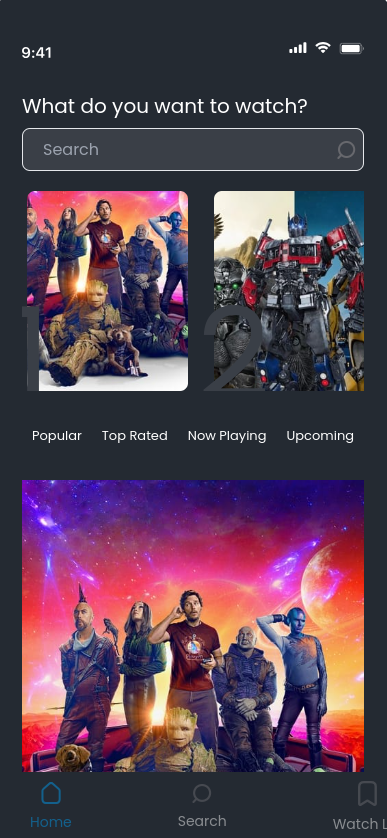
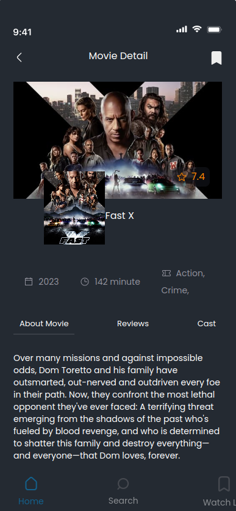
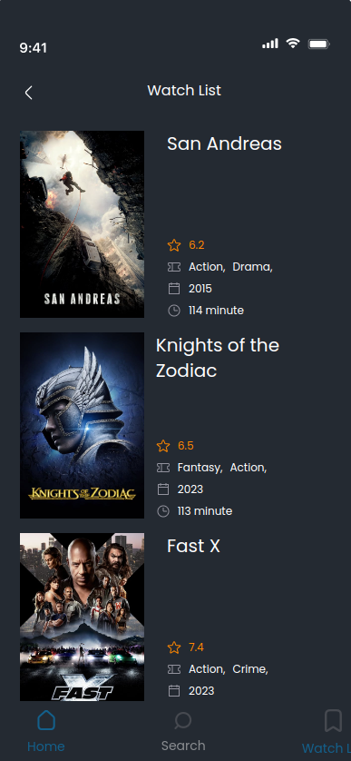
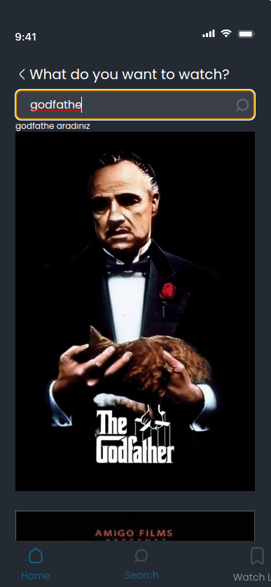
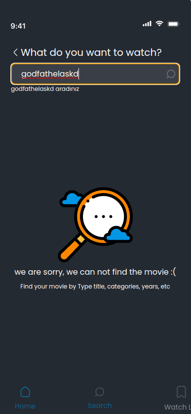

# MovieApp

Welcome to MovieApp! This is a dynamic and clean code project developed using Angular v14 and the TMDB API. It provides various features such as search, movie listing, listing movies by categories, movie details, adding movies to the watchlist using localStorage, and reviews.
> **Note**
> 
> 📢 This project is designed for mobile view but includes responsive design. I recommend you to use it in mobile view
> 
> 📢 Don't forget to configure the `environment.ts` file to run the application locally!

## Getting Started

To get started with MovieApp, follow the instructions below.

### Prerequisites

Make sure you have the following installed on your machine:

- Node.js
- Angular CLI

### Installation

1. Clone the repository:
```
git clone https://github.com/yunusemreerkesikbas/MovieApp.git
```

2. Navigate to the project directory:

```
cd MovieApp
```

3. Install the dependencies:

```
npm install
```

4. Configure the environment:

- Open the `src/environments/environment.ts` file.
- Replace the `MOVIEDB_API_KEY` and `MOVIEDB_API_ACCESS_TOKEN` value with your TMDB API key.

### Development Server

Run the following command to start the development server:
```
ng serve
```

Open your browser and navigate to `http://localhost:4200` to access the MovieApp.

## Features

### Search

Search for movies by title, genre, or any other related keywords.

### Movie Listing

Browse through a list of popular movies or movies sorted by different criteria.

### Category-based Movie Listing

Explore movies by different categories such as popular, top-rated, upcoming, and now playing.

### Movie Details

View detailed information about a specific movie, including its plot, cast, release date, and ratings.

### Watchlist

Add movies to your watchlist using the "Add to Watchlist" button on the movie detail page. The watchlist is stored locally in your browser's localStorage.

### Reviews

Explore movie descriptions, user reviews, and cast information in the Reviews section. In this section, you can:

- Read detailed descriptions of movies to get an overview of the plot, genre, and key details.
- Browse user reviews and opinions about movies to gather insights, recommendations, and different perspectives.
- Discover the cast and crew of the movies, including the actors, directors, and other contributors.

Please note that the MovieApp currently does not support user-submitted reviews. However, you can still benefit from the valuable insights shared by other users and make informed decisions about which movies to watch.
## Screenshots

|               Home                |                   Movie Detail                    |                   Watchlist                   |
|:---------------------------------:|:-------------------------------------------------:|:---------------------------------------------:|
|  |  |  |

|               Search                |                   No Result                    |
|:-----------------------------------:|:----------------------------------------------:|
|  |  |

## Contributing

Contributions are welcome! If you would like to contribute to the MovieApp project, please follow these steps:

1. Fork the repository.
2. Create a new branch.
3. Make your changes and commit them.
4. Push your changes to your forked repository.
5. Submit a pull request.


## Contact

For any inquiries or questions, please contact erkesikbasyunusemre@gmail.com.

Feel free to explore the project and enjoy using the MovieApp!
